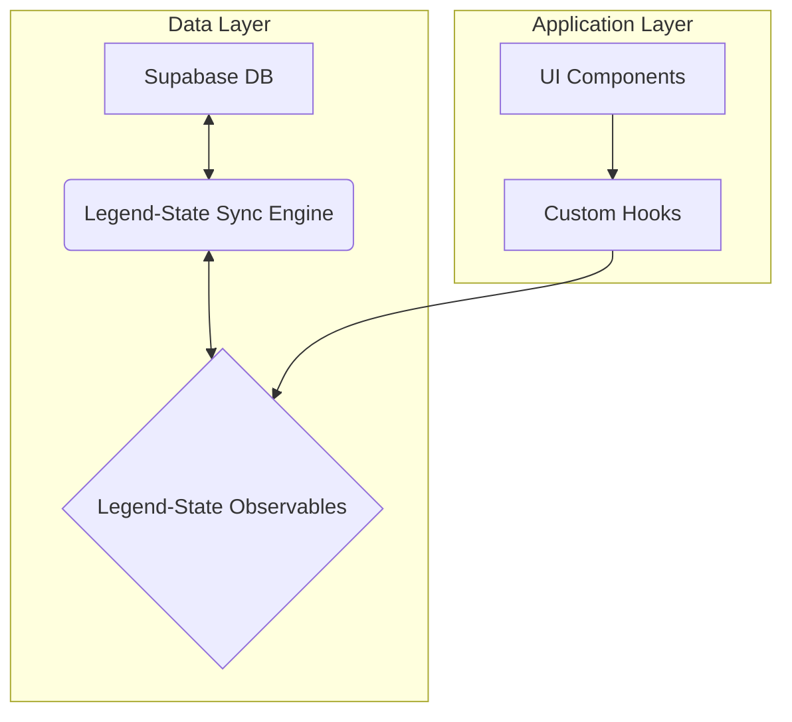

# **5. Data and Component Architecture**

- **Client-Side Data Models**: We will use Legend-State **observables** (e.g., `tasks$`, `healthAndHappiness$`) that mirror the Supabase database schema. These client-side observables will be the single source of truth for the UI.
    
- **`DataSyncProvider` Component**: A high-level component will be created to wrap the application, responsible for initializing Legend-State, configuring the persistence and Supabase sync plugins, and handling the initial data load.
    
- **Custom Hooks (e.g., `useTasks`)**: This is a key pattern. We will create custom hooks to provide a clean API for UI components. These hooks will encapsulate all logic for interacting with the Legend-State observables (e.g., `addTask()`, `getTasksForToday()`), completely abstracting the data layer from the UI.
    

**Component Interaction Diagram:**

Kod snippet'i

