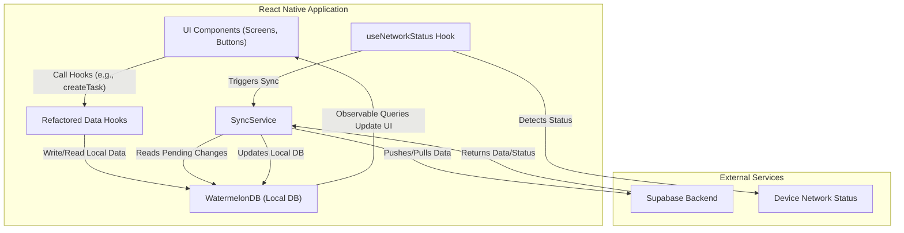

# RoutineTrace Brownfield Enhancement Architecture

## 1. Introduction

This document outlines the architectural approach for enhancing the **RoutineTrace** application by implementing a **local-first data layer with WatermelonDB**. Its primary goal is to serve as the guiding architectural blueprint for this significant enhancement, ensuring seamless and safe integration with the existing system. This architecture will define how new components and data flow patterns are introduced while respecting the established technical foundation.

### Existing Project Analysis

* **Current Project State**:
    * **Primary Purpose**: RoutineTrace is an Android mobile application designed to help users manage and track recurring tasks, with a key feature being the visualization of success percentages to motivate adherence.
    * **Current Tech Stack**: The application is built using React Native and Expo, with TypeScript as the primary language. The backend is Supabase (PostgreSQL and Auth), and the UI is built with React Native Elements.
    * **Current Architecture Style**: The project currently follows an "online-first" model, where the application interacts directly with the Supabase backend for all data operations. The codebase is in its initial, foundational stage.
* **Available Documentation**:
    * The project's technical direction is guided by the PRD, which specifies the technology stack, database schema for tables like `tasks` and `checklistitems`, and core architectural principles.
* **Identified Constraints**:
    * **Technology Stack**: The enhancement must integrate with the existing stack, including React Native, Expo, Supabase, TanStack Query, and React Native Elements.
    * **Architectural Patterns**: The project mandates a strict functional programming paradigm, immutability, and the use of the `Neverthrow` library for handling operational success/failure.
    * **Database Schema**: The new local database schema must be compatible with and mirror the existing Supabase schema structure defined for the project.

## 2. Enhancement Scope and Integration Strategy

This section details the architectural boundaries and approach for integrating the local-first capabilities into RoutineTrace.

### Enhancement Overview

* **Enhancement Type**: Major Architectural Modification.
* **Scope**: The project will shift from an "online-first" architecture to a **"local-first"** model. This involves introducing **WatermelonDB** as the primary client database and building a background synchronization service to communicate with the Supabase backend.
* **Integration Impact**: This is a **Major Impact** enhancement. It will fundamentally refactor the application's entire data management layer.

### Integration Approach

The architecture will be refactored to ensure all UI components are completely decoupled from direct network requests.

* **Code Integration Strategy**: Existing data-fetching and mutation hooks (built with TanStack Query) will be modified. Instead of calling Supabase directly, they will now read from and write to the local WatermelonDB instance. A new, isolated `syncService.ts` will be created to handle all communication with the Supabase backend.
* **Database Integration**: A new WatermelonDB (SQLite) database will be introduced on the client side. Its schema will mirror the existing Supabase schema to ensure data compatibility. All UI components will source their data from this local database, making the application inherently offline-capable.
* **API Integration**: All direct calls to the Supabase client from UI-facing hooks will be eliminated. The `syncService.ts` will become the sole gateway for all network API calls, centralizing the logic for pushing and pulling data.
* **UI Integration**: UI components will become reactive to local data changes through WatermelonDB's observable queries. This will provide an immediate, "optimistic" user experience where the UI updates instantly, regardless of network status.

### Compatibility Requirements

Maintaining system integrity and consistency is paramount during this enhancement.

* **API Compatibility**: The public-facing Supabase API and schema will not be changed. The integration will happen entirely on the client side.
* **Database Schema Compatibility**: The new WatermelonDB schema must be kept in sync with the remote Supabase schema. A `supabase_id` column will be used in local tables to map records between the two databases.
* **UI/UX Consistency**: The user interface will continue to use React Native Elements. From a user's perspective, the change should manifest as a significant improvement in responsiveness and the new ability to use the app fully offline.
* **Performance Impact**: While the goal is to improve perceived UI performance, the background synchronization process must be designed to not degrade UI responsiveness or cause excessive battery drain.

## 3. Tech Stack Alignment

This architecture will adhere to the project's established technology stack while introducing new libraries specifically to enable local-first functionality.

### Existing Technology Stack Usage

| Category | Current Technology | Usage in Enhancement | Notes |
| :--- | :--- | :--- | :--- |
| **Language** | TypeScript | All new code (models, services, hooks) will be written in TypeScript. | Adherence to existing functional and immutable patterns is required. |
| **Framework** | React Native + Expo | The entire feature will be built within the existing Expo framework. | No changes to the underlying native project setup are anticipated. |
| **UI Library** | React Native Elements | Will be used to create any new UI components for sync/network status feedback. | Ensures visual consistency with the rest of the application. |
| **State/Data** | TanStack Query | Will be repurposed to manage the state *of the sync service* (e.g., `isSyncing`, `error`) and to trigger sync operations. | Will no longer be used for direct server data fetching in most views. |
| **Error Handling**| Neverthrow | The `syncService` will use `Result` and `ResultAsync` extensively for robust handling of network and data errors. | Continues the project's established pattern for predictable error management. |

### New Technology Additions

| Technology | Purpose | Rationale | Integration Method |
| :--- | :--- | :--- | :--- |
| **@nozbe/watermelondb** | Core Local Database | Provides the high-performance, observable database that will act as the application's primary data source. | A new `DatabaseProvider` context will make the DB instance available to the app. |
| **@nozbe/watermelondb /adapters/sqlite** | Native Storage Adapter | Enables WatermelonDB to use the device's native SQLite engine for persistent, performant storage. | Configured during the initialization of the WatermelonDB instance. |
| **@react-native-community /netinfo** | Network Status Detection | To monitor the device's online/offline status, which is a critical trigger for the synchronization service. | A new hook (`useNetworkStatus`) will provide this information throughout the app. |
| **@react-native-async-storage /async-storage**| Metadata Storage | To persist small pieces of data required by the sync service, such as the timestamp of the last successful sync. | The `syncService` will read/write to AsyncStorage to manage its state across app sessions. |

## 4. Data Models and Schema Changes

This section defines the new local data models required for the enhancement and the strategy for integrating them with the existing database schema.

### New Data Models

The following WatermelonDB models will be created to mirror the existing Supabase tables.

#### Task

* **Purpose**: Represents a single task or habit that the user wants to track. This is a core entity in the application.
* **Integration**: This local model directly corresponds to the `tasks` table in the Supabase database.
* **Key Attributes**:
    * `id`: (Local WatermelonDB ID)
    * `supabase_id`: string (The UUID from the Supabase `tasks` table, used for mapping)
    * `title`: string
    * `notes`: string
    * `days_of_week`: string (JSON stringified array of `days_of_week` enum)
    * `repeat_frequency`: number
    * `repeat_period`: string (`repeat_period` enum)
    * `updated_at`: number (Unix timestamp)
* **Relationships**:
    * **With New**: Has many `ChecklistItem` records.

#### ChecklistItem

* **Purpose**: Represents a sub-task or a single item within a larger task's checklist.
* **Integration**: This local model directly corresponds to the `checklistitems` table in the Supabase database.
* **Key Attributes**:
    * `id`: (Local WatermelonDB ID)
    * `supabase_id`: string (The UUID from the Supabase `checklistitems` table)
    * `task_id`: string (The `supabase_id` of the parent Task)
    * `content`: string
    * `is_completed`: boolean
    * `updated_at`: number (Unix timestamp)
* **Relationships**:
    * **With New**: Belongs to one `Task` record.

### Schema Integration Strategy

* **Database Changes Required**:
    * The primary change is the **addition of a new client-side WatermelonDB database**. No changes will be made to the remote Supabase schema itself.
    * **New Local Tables**: `tasks`, `checklistitems`, `health_and_happiness`, `task_completion_history`.
    * **New Local Columns**: Each local table will include a `supabase_id` column to map to the remote record and will track its own `created_at` and `updated_at` timestamps.
* **Migration Strategy**:
    * For a first-time user or fresh install, the strategy is a **full initial pull**. The application will fetch all existing records from Supabase and populate the local WatermelonDB tables.
    * For subsequent sessions, an **incremental pull/push** sync will be used based on `updated_at` timestamps.
* **Backward Compatibility**:
    * The remote Supabase schema remains unchanged, ensuring that any other services (if they existed) would not be affected.
    * Client-side application logic must be updated to handle the new data flow. For example, any code relying on a record's ID must be aware of both the local WatermelonDB `id` and the remote `supabase_id` and use the correct one in the appropriate context.

## 5. Component Architecture

This section defines the new logical components required for the enhancement and illustrates how they will integrate with the existing application architecture.

### New Components

#### DatabaseProvider

* **Responsibility**: This component's sole responsibility is to initialize the WatermelonDB instance and provide it to the entire application using a React Context. It will wrap the root of the application layout.
* **Integration Points**: It will be placed at the top level of the component tree, likely in `app/_layout.tsx`, making the database connection available to all child components and hooks.
* **Technology Stack**: React, TypeScript.

#### SyncService

* **Responsibility**: This is a non-UI, singleton service that encapsulates all logic for data synchronization. It will manage the queue of local changes and orchestrate the push/pull of data with the Supabase backend. It will be the only part of the application that communicates directly with Supabase.
* **Integration Points**: It will be triggered by network status changes and application state events (like startup). It reads from the local WatermelonDB to find pending changes and writes back to it after a successful sync.
* **Technology Stack**: TypeScript, Neverthrow, Supabase JS Client.

#### useNetworkStatus Hook

* **Responsibility**: A custom React hook that utilizes `@react-native-community/netinfo` to provide a simple, reactive boolean flag (`isOnline`) to any component that needs it.
* **Integration Points**: This hook will be used by the `SyncService` to trigger synchronization and by UI components to display offline/online status indicators.
* **Technology Stack**: React, TypeScript, `@react-native-community/netinfo`.

#### Refactored Data Hooks (e.g., `useTasksQueries`, `useTasksMutations`)

* **Responsibility**: These existing hooks will be fundamentally refactored. Their new responsibility is to act as a clean interface between the UI components and the local WatermelonDB, not the network.
* **Integration Points**: They will replace direct Supabase calls with WatermelonDB queries. For read operations, they will use observable queries to make the UI reactive. For write operations, they will write directly to the local database, providing an instant, optimistic UI update.
* **Technology Stack**: React, TypeScript, TanStack Query (for sync state), WatermelonDB.

### Component Interaction Diagram

This diagram illustrates the new data flow, showing how the UI is now decoupled from direct network operations.

## 6. API Design and Integration
For this brownfield enhancement, no new backend API endpoints will be created or modified.

The existing Supabase backend provides a standard set of RESTful endpoints for CRUD operations on each database table (e.g., tasks, checklistitems), and this API will continue to be used as-is. The new SyncService will be the sole client-side component that interacts with this existing API.

## 7. External API Integration
This enhancement is focused on refactoring the client-side data layer to work offline and does not involve integrating any new third-party external APIs. The existing Supabase backend remains the sole external service the application communicates with.

## 8. Source Tree Integration
To maintain clarity and consistency with the existing project, all new files related to the offline-first enhancement will be organized into logical, dedicated directories within the src/ folder.

Existing Project Structure (Relevant Snippet)
Plaintext

src/
├── app/              # Application screens/routes (from Expo Router)
├── components/       # Reusable UI components
├── hooks/            # Custom React hooks
├── utils/            # Utility functions
└── ...               # Other existing directories
New File Organization
The following folders and files will be added to the src/ directory.

Plaintext

src/
├── app/
├── components/
├── context/          # New folder for React Context Providers
│   └── DatabaseProvider.tsx  # New: Provides the DB instance to the app.
├── database/         # New folder for all WatermelonDB code
│   ├── models/       # New: For WatermelonDB model definitions (e.g., Task.ts)
│   ├── index.ts      # New: Main DB initialization and export.
│   └── schema.ts     # New: WatermelonDB schema definition.
├── hooks/
│   └── useNetworkStatus.ts # New: Hook to detect online/offline state.
├── services/         # New folder for standalone services
│   └── syncService.ts  # New: Handles all Supabase communication.
└── utils/
Integration Guidelines
File Naming: New files will follow the existing project's convention (e.g., camelCase for files, PascalCase for components and models).

Folder Organization: The new database/, services/, and context/ directories create a clear separation of concerns, ensuring that the offline logic is well-organized and decoupled from the UI and existing utilities.

Import/Export Patterns: The new modules will use standard ES module import/export syntax, consistent with the existing codebase.

## 9. Future Considerations
This section documents potential long-term improvements to the offline-first architecture that are out of scope for the initial implementation but should be considered for future versions.

Advanced Conflict Resolution
While the initial 'Last-write-wins' strategy is suitable for a single-user application, future versions that introduce collaborative features may require more sophisticated conflict resolution logic. This could include strategies like Operational Transforms (OT), Conflict-Free Replicated Data Types (CRDTs), or prompting the user to manually resolve merge conflicts.

Sync Health Monitoring
For long-term reliability and easier debugging, a dedicated monitoring dashboard could be built for support or administrative users. This could provide insights into:

Sync latency and performance.

The number of pending local changes.

A log of sync failures and their resolutions.

Data validation checks to detect data drift between the client and server.